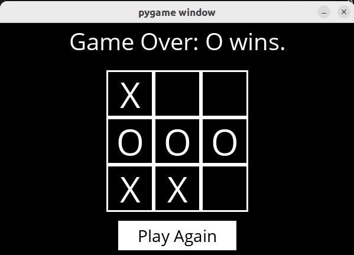

# TicTacToe

Using Minimax, implement an AI to play Tic-Tac-Toe optimally.




## Background

A type of algorithm in adversarial search, [Minimax](https://cs50.harvard.edu/ai/2020/notes/0/#minimax) represents winning conditions as (-1) for one side and (+1) for the other side. Further actions will be driven by these conditions, with the minimizing side trying to get the lowest score, and the maximizer trying to get the highest score.

## Run Locally

This folder contains two code files: `runner.py` and `tictactoe.py`. `tictactoe.py` contains all the logic for playing the game, and for making optimal moves. Minimax algorithm is defined in `minimax` function which makes use of two helper functions: `maxValue` and `minValue`.

To run the program, `cd` into the directory and install the requirement for this program as below:
```shell
pip3 install -r requirements.txt
```
Then, run the program:
```shell
python3 runner.py
```